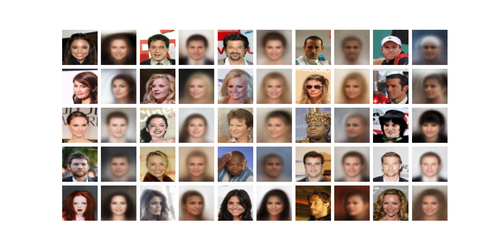

# vae-pytorch

Unofficial Implementation of Variational Auto-Encoder ⭐

### Requirements
- numpy
- matplotlib
- einops
- tqdm
- yaml
- wandb

### Usage

```bash
python main.py --dataset ""
```

choose a dataset
- (default) mnist
- cifar10
- celeba (download it manualy)

### Results



### Implementation lists

- [x] [VAE](https://arxiv.org/abs/1312.6114)

### Todo

- [ ] HVAE
- [ ] MHVAE